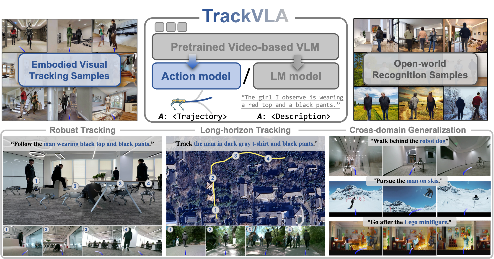

<p align="center">
<h1 align="center"><strong>TrackVLA: Embodied Visual Tracking in the Wild</strong></h1>
  <p align="center">
    <!--   	<strong>CoRL 2025</strong><br> -->
    <a href='https://wsakobe.github.io/' target='_blank'>Shaoan Wang</a>&emsp;
	<a href='https://jzhzhang.github.io/' target='_blank'>Jiazhao Zhang</a>&emsp;
    Minghan Li&emsp;
    Jiahang Liu&emsp;
    Anqi Li&emsp; <br>
    Kui Wu&emsp;
    <a href='https://fangweizhong.xyz/' target='_blank'>Fangwei Zhong</a>&emsp;
    <a href='https://www.coe.pku.edu.cn/teaching/manufacturing/9993.html' target='_blank'>Junzhi Yu</a>&emsp;
	<a href='https://scholar.google.com/citations?user=X7M0I8kAAAAJ&hl=zh-CN' target='_blank'>Zhizheng Zhang</a>&emsp;
  <a href='https://hughw19.github.io/' target='_blank'>He Wang</a>&emsp;
    <br>
    Peking University&emsp; 
    Galbot&emsp; <br>
    Beihang University&emsp;
    Beijing Normal University&emsp;
    Beijing Academy of Artificial Intelligence&emsp;
    <br>
  </p>
</p>

<div id="top" align="center">

[](https://pku-epic.github.io/TrackVLA-web/)
[](http://arxiv.org/abs/2505.23189)
[](https://youtu.be/v51U3Nk-SK4?si=foz3zbYD8hLHSybC)

</div>

## 🏡 About
<strong><em>TrackVLA</em></strong> is a vision-language-action model capable of simultaneous object recognition and visual tracking, trained on a dataset of 1.7 million samples. It demonstrates robust tracking, long-horizon tracking, and cross-domain generalization across diverse challenging environments.
<div style="text-align: center;">
    
</div>

## 📢 News

* [25/10/16]: We are thrilled to announce that Uni-NaVid (a VLA model with discrete actions) has been officially open-sourced and now fully supports testing on the EVT-Bench!
* [25/07/02]: The EVT-Bench is now available.

## 💡 Installation
1. **Preparing conda env**

   First, you need to install [conda](https://docs.conda.io/projects/conda/en/latest/user-guide/install/). Once conda installed, create a new env:
   ```bash
   conda create -n evt_bench python=3.9 cmake=3.14.0
   conda activate evt_bench
   ```

2. **Conda install habitat-sim**
   
   You need to install habitat-sim v0.3.1
      ```
      conda install habitat-sim==0.3.1 withbullet -c conda-forge -c aihabitat
      ```

3. **Clone the repo**
      ```
      git clone https://github.com/wsakobe/TrackVLA.git
      cd TrackVLA
      ```
      
4. **Install habitat-lab**
      ```
      pip install -e habitat-lab
      ```

5. **Prepare datasets**

    Download Habitat Matterport 3D (HM3D) dataset from [here](https://github.com/facebookresearch/habitat-sim/blob/main/DATASETS.md#habitat-matterport-3d-research-dataset-hm3d) and Matterport3D (MP3D) from [here](https://github.com/facebookresearch/habitat-sim/blob/main/DATASETS.md#matterport3d-mp3d-dataset).

    Then move the dataset to `data/scene_datasets`. The structure of the dataset is outlined as follows:
    ```
    data/
     └── scene_datasets/
        ├── hm3d/
        │ ├── train/
        │ │   └── ...
        │ ├── val/
        │ │   └── ...
        │ └── minival
        │     └── ...
        └── mp3d/
          ├── 1LXtFkjw3qL
          │   └── ...
          └── ...
    ```

    Next, run the following code to obtain data for the humanoid avatars:
      ```
      python download_humanoid_data.py
      ```
   If the above download file fails to download, please download the humanoids.zip from this [link](https://drive.google.com/file/d/1aE_wyvPqvOuVmF8px2vTO3trr70DKf1l/view) and then manually unzip it to the data/ directory.


## 🧪 Evaluation
  ### Baseline model
  Run the script with:

    bash eval_baseline.sh

  Results will be saved in the specified SAVE_PATH, which will include a log directory and a video directory. To monitor the results during the evaluation process, run:

    watch -n 1 python analyze_results.py --path YOUR_RESULTS_PATH

  To stop the evaluation, use:

    bash kill_eval.sh

  ### Uni-NaVid
  First, you need to clone the origin repo of Uni-NaVid:

    git clone https://github.com/jzhzhang/Uni-NaVid
   
  Then, you need to link the main code folder of Uni-NaVid to EVT-Bench:

    ln -s /path/to/Uni-NaVid/uninavid /path/to/TrackVLA/uninavid

  Modify eval_uninavid.sh to set the weight path of Uni-NaVid, and run the script with:

    bash eval_uninavid.sh

  Results will be saved in the specified SAVE_PATH, which will include a log directory and a video directory. To monitor the results during the evaluation process, run:

    watch -n 1 python analyze_results.py --path YOUR_RESULTS_PATH

  To stop the evaluation, use:

    bash kill_eval.sh

  Results of Uni-NaVid on EVT-Bench:

  | Evaliation Benchmark |  SR  |  TR  |  CR  | 
  |----------------------|:----:|:----:|:----:|
  | Uni-NaVid EVT-Bench STT  | 53.3 | 67.2 | 12.6 | 
  | Uni-NaVid EVT-Bench STT  | 31.9 | 50.1 | 21.3 | 
  | Uni-NaVid EVT-Bench AT   | 15.8 | 41.5 | 26.5 | 


## 📝 TODO List
- [x] Release the arXiv paper in May, 2025.
- [x] Release the EVT-Bench (Embodied Visual Tracking Benchmark).
- [x] Release the checkpoint and inference code of Uni-NaVid.

## ✉️ Contact
For any questions, please feel free to email wangshaoan@stu.pku.edu.cn. We will respond to it as soon as possible.


## 🔗 Citation
If you find our work helpful, please consider citing it as follows:

```bibtex
@article{wang2025trackvla,
  title={Trackvla: Embodied visual tracking in the wild},
  author={Wang, Shaoan and Zhang, Jiazhao and Li, Minghan and Liu, Jiahang and Li, Anqi and Wu, Kui and Zhong, Fangwei and Yu, Junzhi and Zhang, Zhizheng and Wang, He},
  journal={arXiv preprint arXiv:2505.23189},
  year={2025}
}
```

## 📄 License
<a rel="license" href="http://creativecommons.org/licenses/by-nc-sa/4.0/"></a>
<br />
This work is under the <a rel="license" href="http://creativecommons.org/licenses/by-nc-sa/4.0/">Creative Commons Attribution-NonCommercial-ShareAlike 4.0 International License</a>.
